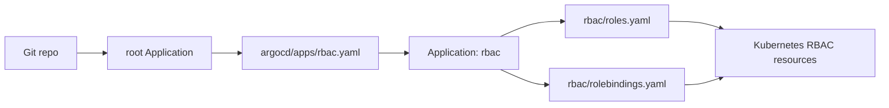

# Lab 1.1 - RBAC: Phân quyền 3 vai trò qua GitOps

## 1. Mục tiêu của bài lab

Bài lab này xử lý tình huống cluster đang ở trạng thái "ai cũng admin". Mục tiêu là chuyển sang mô hình phân quyền rõ ràng bằng Kubernetes RBAC, trong đó mỗi user chỉ có đúng quyền cần thiết.

Ta tạo 3 vai trò:

| User | Vai trò | Phạm vi | Quyền |
| --- | --- | --- | --- |
| `alice` | developer | Chỉ namespace `demo` | CRUD workload như Deployment, Pod, Service |
| `bob` | sre | Toàn cluster | Xem và thao tác Pod ở mọi namespace |
| `carol` | viewer | Toàn cluster | Chỉ đọc bằng `get/list/watch` |

Toàn bộ cấu hình được quản lý qua GitOps bằng ArgoCD. Không dùng `kubectl apply` tay để tạo RBAC, vì nếu làm tay thì Git không còn là nguồn sự thật duy nhất.

## 2. Các khái niệm liên quan

## RBAC là gì?

RBAC là viết tắt của Role-Based Access Control. Đây là cơ chế phân quyền chuẩn của Kubernetes.

RBAC trả lời câu hỏi:

> User hoặc ServiceAccount này có được phép thực hiện hành động này trên tài nguyên này hay không?

Ví dụ:

```bash
kubectl auth can-i create deployment -n demo --as alice
```

Lệnh trên hỏi Kubernetes API Server rằng: nếu người gọi là `alice`, thì có được tạo Deployment trong namespace `demo` không?

## Role

`Role` là tập quyền chỉ có hiệu lực trong một namespace.

Trong bài lab, `alice` là developer của namespace `demo`, nên ta dùng `Role` thay vì `ClusterRole`.

Lý do:

- `alice` chỉ cần làm việc trong `demo`.
- Không muốn `alice` có quyền ở `kube-system`, `monitoring`, `argocd`, hoặc namespace của team khác.
- Đây là nguyên tắc least privilege: cấp ít quyền nhất nhưng vẫn đủ làm việc.

## ClusterRole

`ClusterRole` là tập quyền ở phạm vi toàn cluster.

Trong bài lab, `bob` và `carol` cần quyền toàn cluster:

- `bob` là SRE, cần xem và thao tác Pod ở mọi namespace.
- `carol` là viewer, cần đọc tài nguyên toàn cluster.

Vì vậy ta dùng `ClusterRole` cho hai user này.

## RoleBinding

`RoleBinding` dùng để gán một `Role` hoặc `ClusterRole` cho user/group/serviceaccount trong một namespace cụ thể.

Trong bài lab:

```yaml
kind: RoleBinding
metadata:
  name: alice-developer-binding
  namespace: demo
```

RoleBinding này gán Role `developer` cho user `alice`, nhưng chỉ trong namespace `demo`.

## ClusterRoleBinding

`ClusterRoleBinding` gán `ClusterRole` ở phạm vi toàn cluster.

Trong bài lab:

- `bob-sre-binding` gán ClusterRole `sre` cho `bob`.
- `carol-viewer-binding` gán ClusterRole `viewer` cho `carol`.

Không dùng `ClusterRoleBinding` cho `alice`, vì như vậy sẽ làm quyền developer vượt khỏi namespace `demo`.

## Subject là gì?

`subjects` là danh sách đối tượng được gán quyền.

Trong bài lab, subject là user:

```yaml
subjects:
  - kind: User
    name: alice
    apiGroup: rbac.authorization.k8s.io
```

Điều này nghĩa là quyền được gán cho user tên `alice`. Ta không cần tạo user thật trong Kubernetes cho bài lab này, vì phần nghiệm thu dùng `--as alice` để giả lập user.

## Impersonation với `--as`

`--as` là cơ chế impersonation của `kubectl`.

Ví dụ:

```bash
kubectl auth can-i create deploy -n demo --as alice
```

Admin đang giả lập request dưới danh nghĩa `alice`. Việc này đủ để kiểm tra authorization, tức là kiểm tra quyền RBAC. Bài lab chưa yêu cầu cấu hình authentication thật như certificate, OIDC, SSO hoặc kubeconfig riêng cho từng user.

## GitOps là gì?

GitOps là cách vận hành cluster trong đó Git là nguồn sự thật duy nhất.

Thay vì chạy:

```bash
kubectl apply -f rbac/
```

ta commit file vào Git. ArgoCD theo dõi repo, tự render manifest và sync vào cluster.

Ưu điểm:

- Có lịch sử thay đổi qua commit.
- Review được trước khi apply.
- Có thể rollback bằng Git.
- Tránh drift: nếu ai sửa tay ngoài cluster, ArgoCD có thể tự đưa cluster về đúng trạng thái trong Git.

## 3. Cấu trúc file đã tạo

Bài lab dùng các file sau:

```text
rbac/
├── roles.yaml
└── rolebindings.yaml

argocd/apps/
└── rbac.yaml
```

Ý nghĩa:

- `rbac/roles.yaml`: định nghĩa các quyền, gồm `Role developer`, `ClusterRole sre`, `ClusterRole viewer`.
- `rbac/rolebindings.yaml`: gán các quyền đó cho user `alice`, `bob`, `carol`.
- `argocd/apps/rbac.yaml`: ArgoCD Application trỏ vào thư mục `rbac/` để triển khai RBAC bằng GitOps.

## 4. Bước 1 - Tạo Role cho alice trong namespace demo

Trong `rbac/roles.yaml`, ta tạo `Role` tên `developer` trong namespace `demo`.

Vai trò này cho phép thao tác workload cơ bản:

- Deployment trong API group `apps`.
- Pod trong core API group `""`.
- Pod log để đọc log.
- Service trong core API group.
- ReplicaSet chỉ đọc để xem trạng thái rollout.

Manifest chính:

```yaml
apiVersion: rbac.authorization.k8s.io/v1
kind: Role
metadata:
  name: developer
  namespace: demo
rules:
  - apiGroups: ["apps"]
    resources: ["deployments"]
    verbs: ["get", "list", "watch", "create", "update", "patch", "delete"]
  - apiGroups: [""]
    resources: ["pods"]
    verbs: ["get", "list", "watch", "create", "update", "patch", "delete"]
  - apiGroups: [""]
    resources: ["pods/log"]
    verbs: ["get", "list", "watch"]
  - apiGroups: [""]
    resources: ["services"]
    verbs: ["get", "list", "watch", "create", "update", "patch", "delete"]
  - apiGroups: ["apps"]
    resources: ["replicasets"]
    verbs: ["get", "list", "watch"]
```

Vì sao làm vậy:

- `alice` là developer, nên cần tạo/sửa/xóa workload.
- Scope của `Role` nằm trong namespace `demo`, nên dù có quyền CRUD thì cũng không lan ra namespace khác.
- Không cấp quyền với Secret, RoleBinding, ClusterRoleBinding hoặc Node, vì developer không cần đụng tới các tài nguyên nhạy cảm này.

## 5. Bước 2 - Tạo ClusterRole cho bob

Trong `rbac/roles.yaml`, ta tạo `ClusterRole` tên `sre`.

`bob` là SRE nên cần xem và xử lý Pod ở toàn cluster.

Manifest chính:

```yaml
apiVersion: rbac.authorization.k8s.io/v1
kind: ClusterRole
metadata:
  name: sre
rules:
  - apiGroups: [""]
    resources: ["pods"]
    verbs: ["get", "list", "watch", "create", "update", "patch", "delete"]
  - apiGroups: [""]
    resources: ["pods/log"]
    verbs: ["get", "list", "watch"]
  - apiGroups: [""]
    resources: ["pods/exec"]
    verbs: ["create"]
  - apiGroups: [""]
    resources: ["pods/status"]
    verbs: ["get", "patch", "update"]
  - apiGroups: [""]
    resources: ["events"]
    verbs: ["get", "list", "watch"]
```

Vì sao làm vậy:

- SRE thường cần debug Pod ở nhiều namespace.
- Quyền `pods/log` giúp đọc log.
- Quyền `pods/exec` giúp exec vào container để kiểm tra sự cố.
- Quyền `events` giúp đọc sự kiện cluster khi troubleshooting.
- Không cấp quyền xóa Node, sửa RBAC, đọc Secret toàn cluster, vì bài yêu cầu chỉ thao tác Pod.

## 6. Bước 3 - Tạo ClusterRole viewer cho carol

Trong `rbac/roles.yaml`, ta tạo `ClusterRole` tên `viewer`.

`carol` chỉ được đọc, không được thay đổi tài nguyên.

Manifest chính:

```yaml
apiVersion: rbac.authorization.k8s.io/v1
kind: ClusterRole
metadata:
  name: viewer
rules:
  - apiGroups: [""]
    resources: ["pods", "pods/log", "services", "configmaps",
                "secrets", "events", "namespaces", "endpoints"]
    verbs: ["get", "list", "watch"]
  - apiGroups: ["apps"]
    resources: ["deployments", "replicasets", "statefulsets",
                "daemonsets", "controllerrevisions"]
    verbs: ["get", "list", "watch"]
  - apiGroups: ["networking.k8s.io"]
    resources: ["ingresses", "networkpolicies"]
    verbs: ["get", "list", "watch"]
  - apiGroups: ["autoscaling"]
    resources: ["horizontalpodautoscalers"]
    verbs: ["get", "list", "watch"]
  - apiGroups: ["monitoring.coreos.com"]
    resources: ["prometheusrules", "servicemonitors"]
    verbs: ["get", "list", "watch"]
```

Vì sao làm vậy:

- Viewer chỉ dùng các verb `get`, `list`, `watch`.
- Không có `create`, `update`, `patch`, `delete`.
- Vì là `ClusterRole`, `carol` có thể quan sát toàn cluster nhưng không sửa được gì.

Lưu ý: trong manifest hiện tại viewer có quyền đọc `secrets`. Với môi trường production, cần cân nhắc kỹ vì đọc Secret có thể thấy dữ liệu nhạy cảm nếu không dùng giải pháp mã hóa/ẩn secret phù hợp. Trong bài lab, phần này dùng để minh họa quyền read-only toàn cluster.

## 7. Bước 4 - Gán quyền cho alice bằng RoleBinding

Trong `rbac/rolebindings.yaml`, ta tạo RoleBinding cho `alice`.

```yaml
apiVersion: rbac.authorization.k8s.io/v1
kind: RoleBinding
metadata:
  name: alice-developer-binding
  namespace: demo
roleRef:
  apiGroup: rbac.authorization.k8s.io
  kind: Role
  name: developer
subjects:
  - kind: User
    name: alice
    apiGroup: rbac.authorization.k8s.io
```

Vì sao làm vậy:

- `roleRef.kind: Role` nghĩa là binding này trỏ tới Role `developer`.
- `metadata.namespace: demo` khiến quyền chỉ có hiệu lực trong namespace `demo`.
- `subjects.kind: User` nghĩa là quyền được gán cho user `alice`.

Kết quả mong muốn:

- `alice` tạo Deployment trong `demo`: được.
- `alice` tạo Deployment trong `kube-system`: bị từ chối.

## 8. Bước 5 - Gán quyền cho bob bằng ClusterRoleBinding

Trong `rbac/rolebindings.yaml`, ta tạo ClusterRoleBinding cho `bob`.

```yaml
apiVersion: rbac.authorization.k8s.io/v1
kind: ClusterRoleBinding
metadata:
  name: bob-sre-binding
roleRef:
  apiGroup: rbac.authorization.k8s.io
  kind: ClusterRole
  name: sre
subjects:
  - kind: User
    name: bob
    apiGroup: rbac.authorization.k8s.io
```

Vì sao làm vậy:

- `bob` cần quyền thao tác Pod toàn cluster.
- `ClusterRoleBinding` làm quyền có hiệu lực ở mọi namespace.
- Không cần tạo nhiều RoleBinding lặp lại cho từng namespace.

## 9. Bước 6 - Gán quyền cho carol bằng ClusterRoleBinding

Trong `rbac/rolebindings.yaml`, ta tạo ClusterRoleBinding cho `carol`.

```yaml
apiVersion: rbac.authorization.k8s.io/v1
kind: ClusterRoleBinding
metadata:
  name: carol-viewer-binding
roleRef:
  apiGroup: rbac.authorization.k8s.io
  kind: ClusterRole
  name: viewer
subjects:
  - kind: User
    name: carol
    apiGroup: rbac.authorization.k8s.io
```

Vì sao làm vậy:

- `carol` cần xem toàn cluster.
- `viewer` chỉ có verb `get/list/watch`, nên dù binding toàn cluster thì vẫn không sửa được tài nguyên.
- Đây là mô hình phù hợp cho auditor, observer, hoặc người cần dashboard/troubleshooting read-only.

## 10. Bước 7 - Tạo ArgoCD Application để sync thư mục rbac

File `argocd/apps/rbac.yaml` định nghĩa ArgoCD Application tên `rbac`.

```yaml
apiVersion: argoproj.io/v1alpha1
kind: Application
metadata:
  name: rbac
  namespace: argocd
  annotations:
    argocd.argoproj.io/sync-wave: "0"
spec:
  project: default
  source:
    repoURL: https://github.com/hailv1209/W10-temp.git
    path: rbac
    targetRevision: main
  destination:
    server: https://kubernetes.default.svc
    namespace: ""
  syncPolicy:
    automated:
      prune: true
      selfHeal: true
    syncOptions:
    - ServerSideApply=true
```

Vì sao làm vậy:

- `repoURL` trỏ về repo GitOps của mình.
- `path: rbac` nói với ArgoCD rằng manifest RBAC nằm trong thư mục `rbac/`.
- `targetRevision: main` nghĩa là ArgoCD lấy manifest từ branch `main`.
- `namespace: ""` phù hợp vì trong thư mục có cả tài nguyên cluster-scoped như `ClusterRole` và `ClusterRoleBinding`.
- `automated.prune: true` giúp xóa resource khỏi cluster nếu đã xóa khỏi Git.
- `automated.selfHeal: true` giúp ArgoCD sửa lại nếu có ai chỉnh tay ngoài cluster.
- `ServerSideApply=true` giúp apply các manifest theo cơ chế server-side apply, giảm conflict khi nhiều controller cùng quản lý field.

## 11. Bước 8 - Commit và để ArgoCD sync

Sau khi tạo các file, thay đổi được đưa lên Git:

```bash
git add rbac/roles.yaml rbac/rolebindings.yaml argocd/apps/rbac.yaml
git commit -m "add rbac roles and bindings"
git push origin main
```

Sau đó ArgoCD root app sẽ phát hiện file `argocd/apps/rbac.yaml`, tạo Application `rbac`, rồi Application `rbac` sẽ sync các manifest trong thư mục `rbac/`.

Luồng hoạt động:



Ý nghĩa:

- Ta không apply trực tiếp RBAC bằng kubectl.
- Git là nơi khai báo mong muốn.
- ArgoCD là controller đưa cluster về đúng trạng thái mong muốn đó.

## 12. Bước 9 - Kiểm tra ArgoCD

Sau khi push, kiểm tra Application:

```bash
kubectl -n argocd get application rbac
```

Kỳ vọng:

```text
NAME   SYNCED   HEALTH
rbac   Synced   Healthy
```

Nếu dùng ArgoCD CLI:

```bash
argocd app get rbac
```

Kỳ vọng:

- Sync Status: `Synced`
- Health Status: `Healthy`
- Resources gồm Role, ClusterRole, RoleBinding, ClusterRoleBinding.

## 13. Bước 10 - Nghiệm thu bằng kubectl auth can-i

Bài lab yêu cầu kiểm bằng 4 lệnh.

### Kiểm tra alice tạo Deployment trong demo

```bash
kubectl auth can-i create deploy -n demo --as alice
```

Kỳ vọng:

```text
yes
```

Giải thích:

- `alice` được bind với Role `developer`.
- Role `developer` nằm trong namespace `demo`.
- Role này có verb `create` trên resource `deployments`.

### Kiểm tra alice tạo Deployment trong kube-system

```bash
kubectl auth can-i create deploy -n kube-system --as alice
```

Kỳ vọng:

```text
no
```

Giải thích:

- `alice` chỉ có RoleBinding trong namespace `demo`.
- Không có RoleBinding nào cho `alice` trong `kube-system`.
- Vì vậy request bị từ chối.

### Kiểm tra bob xem Pod toàn cluster

```bash
kubectl auth can-i get pods -A --as bob
```

Kỳ vọng:

```text
yes
```

Giải thích:

- `bob` được bind với ClusterRole `sre`.
- `sre` có quyền `get/list/watch` trên `pods`.
- Binding là `ClusterRoleBinding`, nên có hiệu lực toàn cluster.

### Kiểm tra carol xóa Node

```bash
kubectl auth can-i delete nodes --as carol
```

Kỳ vọng:

```text
no
```

Giải thích:

- `carol` được bind với ClusterRole `viewer`.
- `viewer` chỉ có các verb `get/list/watch`.
- Không có quyền `delete`.
- Manifest cũng không cấp quyền trên resource `nodes`.

## 14. Bảng nghiệm thu cuối cùng

| Lệnh test | Kỳ vọng | Ý nghĩa |
| --- | --- | --- |
| `kubectl auth can-i create deploy -n demo --as alice` | `yes` | Alice được tạo workload trong namespace `demo` |
| `kubectl auth can-i create deploy -n kube-system --as alice` | `no` | Alice không có quyền vượt namespace |
| `kubectl auth can-i get pods -A --as bob` | `yes` | Bob có quyền SRE với Pod toàn cluster |
| `kubectl auth can-i delete nodes --as carol` | `no` | Carol chỉ read-only, không được xóa Node |

Đạt bài lab khi cả 4 lệnh trả đúng như bảng.

## 15. Vì sao thiết kế này đúng với đề bài?

Thiết kế này đúng vì phân quyền theo phạm vi và trách nhiệm:

- `alice` dùng `Role` + `RoleBinding` vì chỉ cần quyền trong namespace `demo`.
- `bob` dùng `ClusterRole` + `ClusterRoleBinding` vì cần thao tác Pod toàn cluster.
- `carol` dùng `ClusterRole` + `ClusterRoleBinding` nhưng chỉ có quyền đọc.
- Không cấp admin rộng cho cả 3 user.
- Không dùng `kubectl apply` tay, toàn bộ RBAC đi qua GitOps.

## 16. RoleBinding khác ClusterRoleBinding như thế nào?

| Thành phần | Phạm vi | Dùng khi nào |
| --- | --- | --- |
| `RoleBinding` | Một namespace | Muốn user có quyền trong một namespace cụ thể |
| `ClusterRoleBinding` | Toàn cluster | Muốn user có quyền ở mọi namespace hoặc trên resource cluster-scoped |

Ví dụ:

- `alice` dùng `RoleBinding` để không chạm được `kube-system`.
- `bob` dùng `ClusterRoleBinding` để xem và xử lý Pod ở mọi namespace.
- `carol` dùng `ClusterRoleBinding` để đọc toàn cluster nhưng không sửa được gì.

## 17. Kết luận

Sau lab này, cluster không còn ở trạng thái "ai cũng admin". Quyền đã được tách theo vai trò:

- Developer chỉ thao tác workload trong namespace của mình.
- SRE có quyền xử lý Pod toàn cluster.
- Viewer chỉ đọc.

Quan trọng hơn, toàn bộ quyền được khai báo trong Git và được ArgoCD sync vào cluster. Đây là nền tảng để vận hành platform an toàn hơn: dễ audit, dễ review, dễ rollback và hạn chế thay đổi tay ngoài Git.
