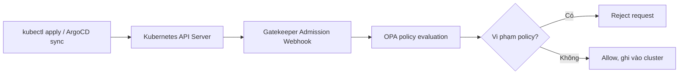

# Lab 1.2 - Gatekeeper: Chặn manifest xấu tại admission

## 1. Mục tiêu của bài lab

Bài lab này cài OPA Gatekeeper vào cluster bằng GitOps và dùng Gatekeeper để chặn các manifest Kubernetes không đạt chuẩn bảo mật ngay tại admission.

Admission là bước API Server kiểm tra request trước khi ghi object vào etcd. Nếu manifest vi phạm policy, request bị từ chối và resource không được tạo.

Bài lab cần enforce 4 luật:

| # | Luật | Risk |
| --- | --- | --- |
| 1 | Cấm image tag `:latest` | F-01 |
| 2 | Bắt buộc container có `resources.limits` | F-02 |
| 3 | Cấm `runAsUser: 0` | F-04 |
| 4 | Cấm `hostNetwork: true` | - |

Kết quả mong muốn: nếu deploy workload vi phạm, API Server reject ngay, không để workload xấu chạy vào cluster.

## 2. Các khái niệm liên quan

## OPA là gì?

OPA là viết tắt của Open Policy Agent. Đây là engine dùng để đánh giá policy.

OPA nhận input dạng JSON, chạy policy được viết bằng Rego, rồi trả lời request đó có hợp lệ hay không.

Trong Kubernetes, OPA thường được dùng để kiểm tra manifest trước khi resource được tạo hoặc cập nhật.

## Gatekeeper là gì?

Gatekeeper là controller đưa OPA vào Kubernetes admission flow.

Gatekeeper tạo Validating Admission Webhook. Khi người dùng apply manifest, API Server gửi request đó qua webhook của Gatekeeper. Gatekeeper đánh giá request bằng policy. Nếu vi phạm, Gatekeeper trả lỗi và API Server từ chối request.

Luồng đơn giản:



## ConstraintTemplate là gì?

`ConstraintTemplate` định nghĩa loại policy mới cho Gatekeeper.

Nó gồm:

- Tên kind của constraint sẽ được tạo, ví dụ `K8sRequiredTags`, `RequireResourcesLimits`.
- Schema tham số nếu policy cần parameter.
- Rego logic dùng để kiểm tra object.

Hiểu ngắn gọn:

> ConstraintTemplate là khuôn. Constraint là bản policy cụ thể được tạo từ khuôn đó.

Ví dụ:

- Template `k8srequiredtags` tạo ra kind `K8sRequiredTags`.
- Sau đó ta tạo Constraint kind `K8sRequiredTags` tên `no-latest-tag`.

## Constraint là gì?

`Constraint` là instance cụ thể của một policy.

Constraint quyết định:

- Policy áp dụng lên kind nào.
- Namespace nào bị áp dụng hoặc bị exclude.
- Parameter cụ thể là gì.
- Enforce bằng deny hay chỉ warn/audit.

Ví dụ constraint `no-latest-tag` dùng template `K8sRequiredTags` và truyền parameter `tags: ["latest"]`.

## Rego là gì?

Rego là ngôn ngữ policy của OPA.

Trong bài lab này không cần tự viết Rego từ đầu. Các template được lấy theo pattern từ Gatekeeper library và đặt trong thư mục `gatekeeper/templates/`.

Điểm chính cần hiểu: nếu Rego sinh ra `violation`, Gatekeeper coi manifest là vi phạm. Khi enforcement ở chế độ deny, API Server reject request.

## Admission là gì?

Admission là bước kiểm soát request sau authentication và authorization, nhưng trước khi object được lưu vào cluster.

Thứ tự đơn giản:

```text
Authentication -> Authorization/RBAC -> Admission -> Persist to etcd
```

RBAC trả lời: user có được phép tạo Deployment không?

Gatekeeper trả lời: Deployment đó có đạt policy bảo mật không?

Hai phần này bổ sung cho nhau. User có quyền tạo resource chưa chắc resource đó được chấp nhận.

## 3. Cấu trúc file trong repo

Bài lab dùng các nhóm file sau:

```text
argocd/apps/
├── gatekeeper.yaml
├── gatekeeper-templates.yaml
└── gatekeeper-constraints.yaml

gatekeeper/
├── templates/
│   ├── no-latest-tag-template.yaml
│   ├── require-resources-limits-template.yaml
│   ├── no-runasroot-template.yaml
│   └── no-hostnetwork-template.yaml
└── constraints/
    ├── no-latest-tag.yaml
    ├── require-resources-limits.yaml
    ├── no-runasroot.yaml
    └── no-hostnetwork.yaml
```

Trong repo hiện tại còn có thêm:

```text
gatekeeper/templates/require-owner-label-template.yaml
gatekeeper/constraints/require-owner-label.yaml
```

Đây là guardrail mở rộng cho các lab sau, không thuộc 4 yêu cầu chính của Lab 1.2.

## 4. Vì sao phải tách controller, template và constraint?

Gatekeeper có thứ tự phụ thuộc rất rõ:

1. Cài Gatekeeper controller trước.
2. Apply `ConstraintTemplate`.
3. Sau khi template sinh ra CRD constraint tương ứng, mới apply `Constraint`.

Nếu apply constraint trước template, Kubernetes sẽ báo lỗi kiểu:

```text
no matches for kind "K8sRequiredTags"
```

Vì tại thời điểm đó API Server chưa biết kind `K8sRequiredTags` là gì.

Vì vậy repo tách thành 3 ArgoCD Application và dùng sync-wave:

| App | File | Wave | Vai trò |
| --- | --- | --- | --- |
| `gatekeeper` | `argocd/apps/gatekeeper.yaml` | `0` | Cài controller/webhook |
| `gatekeeper-templates` | `argocd/apps/gatekeeper-templates.yaml` | `1` | Tạo ConstraintTemplate |
| `gatekeeper-constraints` | `argocd/apps/gatekeeper-constraints.yaml` | `2` | Tạo Constraint enforce policy |

## 5. Bước 1 - Cài Gatekeeper controller bằng GitOps

File `argocd/apps/gatekeeper.yaml` cài Gatekeeper từ Helm chart:

```yaml
apiVersion: argoproj.io/v1alpha1
kind: Application
metadata:
  name: gatekeeper
  namespace: argocd
  annotations:
    argocd.argoproj.io/sync-wave: "0"
spec:
  project: default
  source:
    repoURL: https://open-policy-agent.github.io/gatekeeper/charts
    chart: gatekeeper
    targetRevision: 3.17.0
  destination:
    server: https://kubernetes.default.svc
    namespace: gatekeeper-system
  syncPolicy:
    automated:
      prune: true
      selfHeal: true
    syncOptions:
    - CreateNamespace=true
    - ServerSideApply=true
```

Vì sao làm vậy:

- Cài Gatekeeper bằng Helm chart chính thức.
- Dùng ArgoCD để Git là nguồn sự thật.
- `CreateNamespace=true` để ArgoCD tự tạo namespace `gatekeeper-system`.
- `sync-wave: "0"` để controller có trước template và constraint.

Sau khi sync, cluster có các thành phần chính:

- Pod controller trong namespace `gatekeeper-system`.
- ValidatingWebhookConfiguration để API Server gọi Gatekeeper.
- CRD của Gatekeeper như `ConstraintTemplate`.

## 6. Bước 2 - Tạo Application cho ConstraintTemplate

File `argocd/apps/gatekeeper-templates.yaml` trỏ vào thư mục `gatekeeper/templates`:

```yaml
apiVersion: argoproj.io/v1alpha1
kind: Application
metadata:
  name: gatekeeper-templates
  namespace: argocd
  annotations:
    argocd.argoproj.io/sync-wave: "1"
spec:
  project: default
  source:
    repoURL: https://github.com/hailv1209/W10-temp.git
    path: gatekeeper/templates
    targetRevision: main
  destination:
    server: https://kubernetes.default.svc
    namespace: gatekeeper-system
  syncPolicy:
    automated:
      prune: true
      selfHeal: true
    syncOptions:
    - ServerSideApply=true
```

Vì sao làm vậy:

- Template phải được apply sau khi Gatekeeper controller đã chạy.
- Template là cluster-scoped logic, nhưng vẫn được quản lý bằng GitOps.
- Khi template được tạo, Gatekeeper sẽ tạo ra các custom constraint kind tương ứng.

## 7. Bước 3 - Tạo Application cho Constraint

File `argocd/apps/gatekeeper-constraints.yaml` trỏ vào thư mục `gatekeeper/constraints`:

```yaml
apiVersion: argoproj.io/v1alpha1
kind: Application
metadata:
  name: gatekeeper-constraints
  namespace: argocd
  annotations:
    argocd.argoproj.io/sync-wave: "2"
spec:
  project: default
  source:
    repoURL: https://github.com/hailv1209/W10-temp.git
    path: gatekeeper/constraints
    targetRevision: main
  destination:
    server: https://kubernetes.default.svc
    namespace: gatekeeper-system
  syncPolicy:
    automated:
      prune: true
      selfHeal: true
    syncOptions:
    - ServerSideApply=true
```

Vì sao làm vậy:

- Constraint chỉ apply được sau khi template đã tồn tại.
- Đây là layer enforce thật sự.
- Mọi thay đổi policy đều đi qua Git, không apply tay.

## 8. Luật 1 - Cấm image tag `:latest`

File template:

```text
gatekeeper/templates/no-latest-tag-template.yaml
```

Template này tạo kind:

```yaml
kind: K8sRequiredTags
```

File constraint:

```text
gatekeeper/constraints/no-latest-tag.yaml
```

Constraint chính:

```yaml
apiVersion: constraints.gatekeeper.sh/v1beta1
kind: K8sRequiredTags
metadata:
  name: no-latest-tag
spec:
  match:
    kinds:
      - apiGroups: ["argoproj.io"]
        kinds: ["Rollout"]
      - apiGroups: ["apps"]
        kinds: ["Deployment", "StatefulSet", "DaemonSet"]
    excludedNamespaces:
      - kube-system
      - gatekeeper-system
  parameters:
    tags: ["latest"]
```

Vì sao cấm `:latest`:

- `latest` không immutable.
- Cùng một manifest hôm nay và ngày mai có thể pull ra image khác nhau.
- Rollback khó kiểm soát.
- Không trace được chính xác version đang chạy.

Manifest tốt nên dùng tag pin version hoặc digest:

```yaml
image: ghcr.io/hailv1209/w10-api:0.0.4
```

hoặc:

```yaml
image: ghcr.io/hailv1209/w10-api@sha256:...
```

## 9. Luật 2 - Bắt buộc `resources.limits`

File template:

```text
gatekeeper/templates/require-resources-limits-template.yaml
```

Template này tạo kind:

```yaml
kind: RequireResourcesLimits
```

File constraint:

```text
gatekeeper/constraints/require-resources-limits.yaml
```

Constraint chính:

```yaml
apiVersion: constraints.gatekeeper.sh/v1beta1
kind: RequireResourcesLimits
metadata:
  name: require-pod-limits
spec:
  match:
    kinds:
      - apiGroups: ["argoproj.io"]
        kinds: ["Rollout"]
      - apiGroups: ["apps"]
        kinds: ["Deployment", "StatefulSet", "DaemonSet"]
    excludedNamespaces:
      - kube-system
      - gatekeeper-system
```

Vì sao bắt buộc có limits:

- Không có memory limit, container có thể dùng quá nhiều RAM và gây ảnh hưởng node.
- Không có CPU limit, workload có thể tranh CPU quá mức.
- Resource limit giúp scheduler và kubelet quản lý tài nguyên rõ hơn.
- Đây là guardrail nền tảng cho multi-tenant cluster.

Ví dụ container hợp lệ:

```yaml
resources:
  requests:
    cpu: 100m
    memory: 128Mi
  limits:
    cpu: 500m
    memory: 512Mi
```

Lưu ý: bài lab yêu cầu `resources.limits`, nhưng trong thực tế nên khai báo cả `requests` và `limits` để scheduler ra quyết định tốt hơn.

## 10. Luật 3 - Cấm `runAsUser: 0`

File template:

```text
gatekeeper/templates/no-runasroot-template.yaml
```

Template này tạo kind:

```yaml
kind: ForbidRootUser
```

File constraint:

```text
gatekeeper/constraints/no-runasroot.yaml
```

Constraint chính:

```yaml
apiVersion: constraints.gatekeeper.sh/v1beta1
kind: ForbidRootUser
metadata:
  name: no-runasroot
spec:
  match:
    kinds:
      - apiGroups: ["argoproj.io"]
        kinds: ["Rollout"]
      - apiGroups: ["apps"]
        kinds: ["Deployment", "StatefulSet", "DaemonSet"]
    excludedNamespaces:
      - kube-system
      - gatekeeper-system
```

Vì sao cấm chạy root:

- Container chạy UID `0` có quyền cao hơn trong container.
- Nếu có lỗ hổng escape hoặc mount sai quyền, rủi ro ảnh hưởng node tăng lên.
- Non-root container giúp giảm blast radius.

Ví dụ hợp lệ:

```yaml
securityContext:
  runAsNonRoot: true
  runAsUser: 10001
```

Hoặc đặt ở container:

```yaml
containers:
  - name: app
    image: ghcr.io/hailv1209/w10-api:0.0.4
    securityContext:
      runAsUser: 10001
```

## 11. Luật 4 - Cấm `hostNetwork: true`

File template:

```text
gatekeeper/templates/no-hostnetwork-template.yaml
```

Template này tạo kind:

```yaml
kind: ForbidHostNetwork
```

File constraint:

```text
gatekeeper/constraints/no-hostnetwork.yaml
```

Constraint chính:

```yaml
apiVersion: constraints.gatekeeper.sh/v1beta1
kind: ForbidHostNetwork
metadata:
  name: no-hostnetwork
spec:
  match:
    kinds:
      - apiGroups: ["argoproj.io"]
        kinds: ["Rollout"]
      - apiGroups: ["apps"]
        kinds: ["Deployment", "StatefulSet", "DaemonSet"]
    excludedNamespaces:
      - kube-system
      - gatekeeper-system
```

Vì sao cấm `hostNetwork`:

- Pod dùng network namespace của node.
- Có thể bypass một số network isolation dựa trên Pod network.
- Tăng rủi ro đụng port với service trên node.
- Không phù hợp cho workload application thông thường.

Một số component hệ thống có thể cần hostNetwork, nên constraint exclude `kube-system` và `gatekeeper-system`.

## 12. Vì sao exclude `kube-system` và `gatekeeper-system`?

Trong các constraint, repo exclude:

```yaml
excludedNamespaces:
  - kube-system
  - gatekeeper-system
```

Lý do:

- `kube-system` chứa component hệ thống như CoreDNS, kube-proxy, control-plane pod.
- `gatekeeper-system` chứa chính Gatekeeper controller.
- Nếu enforce quá sớm hoặc quá rộng, có thể tự chặn component nền tảng.

Đây là cách tránh làm platform tự sập khi bật policy.

## 13. Kiểm tra app hiện tại trước khi enforce

Trước khi bật deny, cần kiểm tra workload platform có hợp lệ không.

Các điểm cần kiểm:

- Image không dùng `:latest`.
- Container có `resources.limits`.
- Không set `runAsUser: 0`.
- Không set `hostNetwork: true`.

Ví dụ với app `api`, image nên pin version:

```yaml
image: ghcr.io/hailv1209/w10-api:0.0.4
```

Container nên có resources:

```yaml
resources:
  requests:
    cpu: 100m
    memory: 128Mi
  limits:
    cpu: 500m
    memory: 512Mi
```

Nếu platform đang vi phạm mà bật deny ngay, chính ArgoCD rollout của mình có thể bị Gatekeeper chặn.

## 14. Chế độ `warn` và `deny`

Gatekeeper constraint có thể dùng `enforcementAction`.

Ví dụ chạy audit/warn trước:

```yaml
spec:
  enforcementAction: warn
```

Ý nghĩa:

- Gatekeeper vẫn phát hiện violation.
- Nhưng chưa chặn request.
- Dùng để audit resource đang vi phạm trước khi enforce.

Khi đã sửa hết workload vi phạm, chuyển sang deny:

```yaml
spec:
  enforcementAction: deny
```

Hoặc bỏ `enforcementAction`, Gatekeeper mặc định enforce như deny tùy version/config.

Trong bài lab, mục tiêu nghiệm thu là deploy vi phạm phải bị reject, nên trạng thái cuối là enforce deny.

## 15. Cách commit và để ArgoCD sync

Sau khi tạo/sửa các file:

```bash
git add argocd/apps/gatekeeper.yaml \
        argocd/apps/gatekeeper-templates.yaml \
        argocd/apps/gatekeeper-constraints.yaml \
        gatekeeper/templates \
        gatekeeper/constraints

git commit -m "add gatekeeper admission policies"
git push origin main
```

Root Application sẽ sync các Application con:

```text
root
├── gatekeeper
├── gatekeeper-templates
└── gatekeeper-constraints
```

Kiểm tra trạng thái:

```bash
kubectl -n argocd get application gatekeeper
kubectl -n argocd get application gatekeeper-templates
kubectl -n argocd get application gatekeeper-constraints
```

Kỳ vọng:

```text
Synced / Healthy
```

Kiểm tra resource Gatekeeper:

```bash
kubectl get constrainttemplates
kubectl get k8srequiredtags.constraints.gatekeeper.sh
kubectl get requireresourceslimits.constraints.gatekeeper.sh
kubectl get forbidrootuser.constraints.gatekeeper.sh
kubectl get forbidhostnetwork.constraints.gatekeeper.sh
```

## 16. Nghiệm thu 1 - Image `:latest` bị reject

Vì constraint trong repo match workload có Pod template như Deployment/Rollout/StatefulSet/DaemonSet, ta test bằng Deployment thay vì Pod trần.

Manifest vi phạm:

```yaml
apiVersion: apps/v1
kind: Deployment
metadata:
  name: bad-latest
  namespace: demo
  labels:
    owner: hailv
spec:
  replicas: 1
  selector:
    matchLabels:
      app: bad-latest
  template:
    metadata:
      labels:
        app: bad-latest
        owner: hailv
    spec:
      containers:
        - name: app
          image: nginx:latest
          resources:
            limits:
              cpu: 100m
              memory: 128Mi
```

Apply:

```bash
kubectl apply -f bad-latest.yaml
```

Kỳ vọng:

```text
admission webhook "validation.gatekeeper.sh" denied the request
```

Thông điệp sẽ nói container dùng forbidden image tag `latest`.

## 17. Nghiệm thu 2 - Thiếu `resources.limits` bị reject

Manifest vi phạm:

```yaml
apiVersion: apps/v1
kind: Deployment
metadata:
  name: bad-no-limits
  namespace: demo
  labels:
    owner: hailv
spec:
  replicas: 1
  selector:
    matchLabels:
      app: bad-no-limits
  template:
    metadata:
      labels:
        app: bad-no-limits
        owner: hailv
    spec:
      containers:
        - name: app
          image: nginx:1.25
```

Apply:

```bash
kubectl apply -f bad-no-limits.yaml
```

Kỳ vọng:

```text
admission webhook "validation.gatekeeper.sh" denied the request
```

Thông điệp sẽ nói container phải định nghĩa `resources.limits`.

## 18. Nghiệm thu 3 - `runAsUser: 0` bị reject

Manifest vi phạm:

```yaml
apiVersion: apps/v1
kind: Deployment
metadata:
  name: bad-root
  namespace: demo
  labels:
    owner: hailv
spec:
  replicas: 1
  selector:
    matchLabels:
      app: bad-root
  template:
    metadata:
      labels:
        app: bad-root
        owner: hailv
    spec:
      containers:
        - name: app
          image: nginx:1.25
          securityContext:
            runAsUser: 0
          resources:
            limits:
              cpu: 100m
              memory: 128Mi
```

Apply:

```bash
kubectl apply -f bad-root.yaml
```

Kỳ vọng:

```text
admission webhook "validation.gatekeeper.sh" denied the request
```

Thông điệp sẽ nói container không được chạy root user.

## 19. Nghiệm thu 4 - `hostNetwork: true` bị reject

Manifest vi phạm:

```yaml
apiVersion: apps/v1
kind: Deployment
metadata:
  name: bad-hostnetwork
  namespace: demo
  labels:
    owner: hailv
spec:
  replicas: 1
  selector:
    matchLabels:
      app: bad-hostnetwork
  template:
    metadata:
      labels:
        app: bad-hostnetwork
        owner: hailv
    spec:
      hostNetwork: true
      containers:
        - name: app
          image: nginx:1.25
          resources:
            limits:
              cpu: 100m
              memory: 128Mi
```

Apply:

```bash
kubectl apply -f bad-hostnetwork.yaml
```

Kỳ vọng:

```text
admission webhook "validation.gatekeeper.sh" denied the request
```

Thông điệp sẽ nói Pod không được dùng `hostNetwork: true`.

## 20. Nghiệm thu 5 - Workload hợp lệ được cho qua

Manifest hợp lệ:

```yaml
apiVersion: apps/v1
kind: Deployment
metadata:
  name: good-app
  namespace: demo
  labels:
    owner: hailv
spec:
  replicas: 1
  selector:
    matchLabels:
      app: good-app
  template:
    metadata:
      labels:
        app: good-app
        owner: hailv
    spec:
      securityContext:
        runAsNonRoot: true
        runAsUser: 10001
      containers:
        - name: app
          image: nginx:1.25
          resources:
            requests:
              cpu: 50m
              memory: 64Mi
            limits:
              cpu: 100m
              memory: 128Mi
```

Apply:

```bash
kubectl apply -f good-app.yaml
```

Kỳ vọng:

```text
deployment.apps/good-app created
```

Vì sao pass:

- Image không dùng `:latest`.
- Có `resources.limits`.
- Không chạy root.
- Không dùng `hostNetwork`.
- Có label `owner`, phù hợp với guardrail mở rộng hiện có trong repo.

## 21. Bảng nghiệm thu cuối cùng

| Tình huống | Kỳ vọng | Lý do |
| --- | --- | --- |
| Deployment dùng image `nginx:latest` | Reject | Vi phạm `no-latest-tag` |
| Deployment thiếu `resources.limits` | Reject | Vi phạm `require-pod-limits` |
| Deployment set `runAsUser: 0` | Reject | Vi phạm `no-runasroot` |
| Deployment set `hostNetwork: true` | Reject | Vi phạm `no-hostnetwork` |
| Deployment hợp lệ | Pass | Không vi phạm 4 luật |

## 22. Cách xem violation trong cluster

Có thể inspect từng constraint:

```bash
kubectl describe k8srequiredtags.constraints.gatekeeper.sh no-latest-tag
kubectl describe requireresourceslimits.constraints.gatekeeper.sh require-pod-limits
kubectl describe forbidrootuser.constraints.gatekeeper.sh no-runasroot
kubectl describe forbidhostnetwork.constraints.gatekeeper.sh no-hostnetwork
```

Gatekeeper cũng có audit controller. Các resource đang vi phạm có thể xuất hiện trong phần status violation của constraint.

Kiểm tra log controller nếu cần:

```bash
kubectl -n gatekeeper-system logs deploy/gatekeeper-controller-manager
```

## 23. Những lỗi dễ gặp

## Lỗi 1: Apply constraint trước template

Triệu chứng:

```text
no matches for kind "ForbidRootUser"
```

Cách xử lý:

- Đảm bảo `gatekeeper` wave `0`.
- `gatekeeper-templates` wave `1`.
- `gatekeeper-constraints` wave `2`.

## Lỗi 2: Platform tự bị chặn

Triệu chứng:

ArgoCD sync fail vì workload của chính platform vi phạm.

Ví dụ:

- Image dùng `:latest`.
- Container thiếu `resources.limits`.
- Container set `runAsUser: 0`.

Cách xử lý:

- Chạy `enforcementAction: warn` trước.
- Sửa workload hiện có.
- Sau đó chuyển sang deny.

## Lỗi 3: Test bằng Pod trần nhưng constraint không bắt

Trong repo này, Rego đang đọc:

```rego
input.review.object.spec.template.spec.containers
```

Đường dẫn này là cấu trúc của workload như Deployment/Rollout/StatefulSet/DaemonSet, không phải Pod trần.

Vì vậy khi nghiệm thu với manifest hiện tại, nên test bằng Deployment hoặc Rollout. Nếu muốn bắt cả Pod trần, cần mở rộng template Rego và match thêm kind `Pod`.

## 24. Vì sao thiết kế này đúng với đề bài?

Thiết kế này đúng vì:

- Gatekeeper được cài bằng GitOps, không apply tay.
- Template và Constraint được tách riêng, đúng thứ tự phụ thuộc.
- 4 luật admission map đúng với risk trong đề.
- Workload vi phạm bị API Server reject trước khi chạy.
- Workload hợp lệ vẫn deploy được.
- Có thể audit bằng warn trước khi enforce deny để tránh tự làm sập platform.

## 25. Kết luận

Sau Lab 1.2, cluster có một lớp admission guardrail rõ ràng:

- Không chạy image `latest`.
- Không chạy workload thiếu resource limit.
- Không chạy container root.
- Không cho workload application dùng host network.

RBAC ở Lab 1.1 kiểm soát ai được làm gì. Gatekeeper ở Lab 1.2 kiểm soát manifest được tạo có an toàn hay không. Hai lớp này kết hợp lại giúp platform không chỉ phân quyền đúng, mà còn ngăn cấu hình xấu đi vào cluster.
