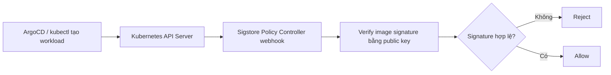

# Lab 2.2 - Trivy + Cosign: Scan, ký và verify image

## 1. Mục tiêu của bài lab

Bài lab này xây dựng một chuỗi kiểm soát bảo mật cho container image trước khi workload được chạy trong cluster.

Yêu cầu chính:

| # | Việc cần làm | Risk |
| --- | --- | --- |
| a | Dùng Trivy trong CI, fail pipeline nếu image có CVE `HIGH` hoặc `CRITICAL` | F-05 |
| b | Dùng Cosign ký image sau khi build | F-06 |
| c | Dùng admission policy để reject image chưa ký | F-06 |

Kết quả mong muốn:

- Image có CVE nghiêm trọng thì không được push/deploy.
- Image đã qua scan thì được ký bằng Cosign.
- Cluster chỉ cho chạy image đã có chữ ký hợp lệ.

## 2. Các khái niệm liên quan

## Trivy là gì?

Trivy là công cụ scan bảo mật cho container image, filesystem, Git repository, Kubernetes manifest và nhiều loại artifact khác.

Trong bài lab này, Trivy được dùng trong GitHub Actions để scan image vừa build.

Trivy kiểm tra:

- OS package vulnerabilities.
- Library/application dependencies.
- Mức độ nghiêm trọng của CVE như `LOW`, `MEDIUM`, `HIGH`, `CRITICAL`.

Trong workflow của repo, pipeline fail nếu Trivy phát hiện CVE mức:

```yaml
severity: HIGH,CRITICAL
exit-code: '1'
```

Điều này nghĩa là image không sạch thì không đi tiếp sang bước push/sign.

## CVE là gì?

CVE là viết tắt của Common Vulnerabilities and Exposures.

Mỗi CVE là một mã định danh cho một lỗ hổng bảo mật đã được công bố, ví dụ:

```text
CVE-2026-12345
```

Không phải CVE nào cũng nguy hiểm như nhau. Vì vậy bài lab chỉ block mức `HIGH` và `CRITICAL`.

## Cosign là gì?

Cosign là công cụ của Sigstore dùng để ký và verify container image.

Cosign giúp trả lời câu hỏi:

> Image này có đúng là image đã được pipeline tin cậy ký hay không?

Trong bài lab này:

- Private key dùng để ký image trong GitHub Actions.
- Public key được commit vào repo.
- Admission controller dùng public key để verify image trước khi cho pod chạy.

## Image signing là gì?

Image signing là việc tạo chữ ký số cho image.

Luồng cơ bản:

```text
Image digest + private key -> signature
Image digest + signature + public key -> verify pass/fail
```

Nếu ai đó push image giả mạo hoặc image chưa được pipeline ký, signature verification sẽ fail.

## Sigstore Policy Controller là gì?

Sigstore Policy Controller là admission controller trong Kubernetes.

Nó đọc các policy như `ClusterImagePolicy`, sau đó kiểm tra image trong Pod/Deployment/Rollout trước khi workload được tạo.

Nếu image chưa ký hoặc chữ ký không khớp public key, API Server reject request.

Luồng admission:



## ClusterImagePolicy là gì?

`ClusterImagePolicy` là custom resource của Sigstore Policy Controller.

Nó khai báo:

- Image nào cần verify.
- Dùng authority nào để verify.
- Public key nào được tin cậy.

Trong repo này, policy yêu cầu image `ghcr.io/hailv1209/w10-api*` phải được ký bằng Cosign key đã commit.

## 3. Cấu trúc file trong repo

Các file chính của Lab 2.2:

```text
.github/workflows/
├── build-push.yml
└── sign-image.yml

signing/
└── cosign.pub

policies/
└── cluster-image-policy.yaml

argocd/apps/
├── policy-controller.yaml
└── policies.yaml

docs/adr/
└── ADR-0001-trivy-cve-exceptions.md
```

Ý nghĩa:

- `.github/workflows/build-push.yml`: build image, scan bằng Trivy, push image, ký bằng Cosign.
- `.github/workflows/sign-image.yml`: workflow helper để ký lại image tag đã tồn tại.
- `signing/cosign.pub`: public key dùng để verify chữ ký image.
- `policies/cluster-image-policy.yaml`: admission policy yêu cầu image phải có chữ ký.
- `argocd/apps/policy-controller.yaml`: cài Sigstore Policy Controller qua Helm.
- `argocd/apps/policies.yaml`: sync thư mục `policies/` vào cluster.
- `docs/adr/ADR-0001-trivy-cve-exceptions.md`: nơi ghi exception có thời hạn nếu vendor chưa fix CVE.

## 4. Bước 1 - Tạo Cosign keypair

Cosign cần một cặp key:

- Private key: dùng để ký image.
- Public key: dùng để verify image.

Lệnh tạo keypair:

```powershell
$env:COSIGN_PASSWORD = "<passphrase>"
docker run --rm -e COSIGN_PASSWORD -v ${PWD}\signing:/work -w /work `
  gcr.io/projectsigstore/cosign:v2.4.3 generate-key-pair
```

Sau khi chạy, thư mục `signing/` có:

```text
signing/cosign.key
signing/cosign.pub
```

Private key không được commit.

Repo đã ignore private key bằng `.gitignore`:

```gitignore
signing/*.key
signing/*.key.bak
```

Vì sao làm vậy:

- Private key là bí mật dùng để ký image.
- Nếu private key bị lộ, người khác có thể ký image độc hại.
- Public key không phải secret, nên được commit để cluster dùng verify.

## 5. Bước 2 - Đưa private key vào GitHub Secrets

Private key và password được đưa vào GitHub Actions Secrets:

```text
COSIGN_PRIVATE_KEY
COSIGN_PASSWORD
```

Ý nghĩa:

- `COSIGN_PRIVATE_KEY`: nội dung file `signing/cosign.key`.
- `COSIGN_PASSWORD`: passphrase đã dùng khi generate keypair.

Workflow sẽ đọc private key qua environment:

```bash
cosign sign --yes --key env://COSIGN_PRIVATE_KEY "$tag"
```

Không commit private key vào Git.

## 6. Bước 3 - Commit public key

Public key nằm ở:

```text
signing/cosign.pub
```

Nội dung public key hiện được dùng trong `ClusterImagePolicy`:

```yaml
authorities:
  - name: w10-api-cosign-key
    key:
      data: |
        -----BEGIN PUBLIC KEY-----
        ...
        -----END PUBLIC KEY-----
```

Vì sao public key được commit:

- Public key chỉ dùng để verify.
- Không thể dùng public key để ký image.
- Cluster cần public key để xác định image có được ký bởi private key tin cậy hay không.

## 7. Bước 4 - Thêm Trivy scan vào CI

File workflow:

```text
.github/workflows/build-push.yml
```

Workflow build image local trước:

```yaml
- name: Build Docker image for security scan
  uses: docker/build-push-action@v6
  with:
    context: ./src/api
    push: false
    load: true
    tags: ${{ steps.meta.outputs.tags }}
    labels: ${{ steps.meta.outputs.labels }}
```

Sau đó scan bằng Trivy:

```yaml
- name: Scan image with Trivy
  uses: aquasecurity/trivy-action@v0.36.0
  with:
    image-ref: ${{ env.REGISTRY }}/${{ env.IMAGE_NAME }}:${{ steps.semver.outputs.version }}
    severity: HIGH,CRITICAL
    vuln-type: os,library
    exit-code: '1'
    format: table
```

Vì sao build local rồi scan trước khi push:

- Image chưa sạch thì không được đưa lên registry.
- Trivy fail bằng `exit-code: '1'`, làm GitHub Actions đỏ.
- Chặn sớm ở CI giúp giảm rác và giảm rủi ro image lỗi đi vào registry.

## 8. Bước 5 - Chỉ push image sau khi scan pass

Sau khi Trivy pass, workflow mới push image tags:

```bash
while IFS= read -r tag; do
  [ -n "$tag" ] && docker push "$tag"
done <<'EOF'
${{ steps.meta.outputs.tags }}
EOF
```

Workflow tạo nhiều tag:

```yaml
tags: |
  type=raw,value=latest
  type=raw,value=${{ steps.semver.outputs.version }}
  type=sha,prefix=v${{ steps.semver.outputs.version }}-
```

Điểm quan trọng:

- Image version tag là tag Rollout thật sự dùng.
- Không chỉ ký `latest`.
- Nếu workload dùng `0.0.4`, thì tag `0.0.4` phải được ký.

Đây là bẫy phổ biến: CI ký `latest` nhưng Kubernetes lại deploy tag version khác, làm admission reject.

## 9. Bước 6 - Ký image bằng Cosign

Sau khi push, workflow cài Cosign:

```yaml
- name: Install Cosign
  uses: sigstore/cosign-installer@v3.8.2
```

Sau đó ký từng tag vừa push:

```yaml
- name: Sign pushed image tags with Cosign
  env:
    COSIGN_PRIVATE_KEY: ${{ secrets.COSIGN_PRIVATE_KEY }}
    COSIGN_PASSWORD: ${{ secrets.COSIGN_PASSWORD }}
  run: |
    while IFS= read -r tag; do
      [ -n "$tag" ] && cosign sign --yes --key env://COSIGN_PRIVATE_KEY "$tag"
    done <<'EOF'
    ${{ steps.meta.outputs.tags }}
    EOF
```

Vì sao ký sau khi push:

- Cosign lưu signature gắn với image trong registry.
- Image phải tồn tại trong registry để signature có thể attach/verify ổn định.
- Admission controller verify image dựa trên registry reference.

## 10. Bước 7 - Update Rollout sang tag đã ký

Workflow cập nhật `app-api/rollout.yaml`:

```bash
sed -i "s|image: ghcr.io/.*/w10-api:.*|image: ${{ env.REGISTRY }}/${{ env.IMAGE_NAME }}:${{ steps.semver.outputs.version }}|g" app-api/rollout.yaml
sed -i "s|value: \"v.*\"|value: \"v${{ steps.semver.outputs.version }}\"|g" app-api/rollout.yaml
```

Trong repo hiện tại Rollout dùng:

```yaml
image: ghcr.io/hailv1209/w10-api:0.0.4
```

Vì sao bước này quan trọng:

- Admission verify image đang deploy, không verify image "từng được build".
- Tag trong manifest phải là tag đã được Cosign ký.
- Nếu manifest vẫn dùng tag cũ chưa ký, rollout sẽ bị reject.

## 11. Bước 8 - Helper workflow để ký image có sẵn

Repo có thêm workflow:

```text
.github/workflows/sign-image.yml
```

Workflow này dùng khi cần ký một image tag đã tồn tại:

```yaml
workflow_dispatch:
  inputs:
    image:
      description: Image reference to sign
      required: true
      default: ghcr.io/hailv1209/w10-api:0.0.3
```

Lệnh ký:

```bash
cosign sign --yes --key env://COSIGN_PRIVATE_KEY "${{ inputs.image }}"
```

Vì sao cần workflow này:

- Có thể cluster đang chạy image tag cũ trước khi bật admission verify.
- Nếu bật namespace enforcement ngay, workload cũ chưa ký có thể bị chặn khi recreate.
- Helper workflow giúp ký lại tag cũ mà không cần rebuild.

## 12. Bước 9 - Cài Sigstore Policy Controller bằng GitOps

File:

```text
argocd/apps/policy-controller.yaml
```

Manifest chính:

```yaml
apiVersion: argoproj.io/v1alpha1
kind: Application
metadata:
  name: policy-controller
  namespace: argocd
  annotations:
    argocd.argoproj.io/sync-wave: "1"
spec:
  project: default
  source:
    repoURL: https://sigstore.github.io/helm-charts
    chart: policy-controller
    targetRevision: 0.10.6
    helm:
      values: |
        installCRDs: true
        webhook:
          customLabels:
            owner: hailv
          resources:
            limits:
              cpu: 500m
              memory: 1Gi
        leasescleanup:
          resources:
            limits:
              cpu: 100m
              memory: 128Mi
  destination:
    server: https://kubernetes.default.svc
    namespace: cosign-system
```

Vì sao làm vậy:

- Policy Controller phải có trước `ClusterImagePolicy`.
- `installCRDs: true` để chart cài CRD cần thiết.
- `sync-wave: "1"` để chạy trước app policy.
- Thêm resources/labels để không bị Gatekeeper guardrail chặn.

## 13. Bước 10 - Sync ClusterImagePolicy bằng GitOps

File:

```text
argocd/apps/policies.yaml
```

Manifest chính:

```yaml
apiVersion: argoproj.io/v1alpha1
kind: Application
metadata:
  name: image-policies
  namespace: argocd
  annotations:
    argocd.argoproj.io/sync-wave: "2"
spec:
  project: default
  source:
    repoURL: https://github.com/hailv1209/W10-temp.git
    path: policies
    targetRevision: main
  destination:
    server: https://kubernetes.default.svc
    namespace: cosign-system
```

Vì sao tách thành 2 App:

- `policy-controller` cài CRD trước.
- `image-policies` apply `ClusterImagePolicy` sau.
- Nếu sync cùng lúc, có thể gặp lỗi "no matches for kind ClusterImagePolicy".

## 14. Bước 11 - Tạo ClusterImagePolicy

File:

```text
policies/cluster-image-policy.yaml
```

Policy hiện tại:

```yaml
apiVersion: policy.sigstore.dev/v1beta1
kind: ClusterImagePolicy
metadata:
  name: require-signed-w10-api
  labels:
    owner: hailv
spec:
  images:
    - glob: ghcr.io/hailv1209/w10-api*
  authorities:
    - name: w10-api-cosign-key
      key:
        data: |
          -----BEGIN PUBLIC KEY-----
          ...
          -----END PUBLIC KEY-----
```

Ý nghĩa:

- Chỉ áp dụng cho image match `ghcr.io/hailv1209/w10-api*`.
- Dùng public key `w10-api-cosign-key` để verify.
- Image không có signature hợp lệ sẽ bị reject.

## 15. Bước 12 - Bật enforcement cho namespace

Sigstore Policy Controller chỉ enforce namespace có label:

```yaml
policy.sigstore.dev/include: "true"
```

Trong repo, namespace `demo` đã được label trong:

```text
app-common/demo-namespace.yaml
```

Manifest:

```yaml
apiVersion: v1
kind: Namespace
metadata:
  name: demo
  labels:
    policy.sigstore.dev/include: "true"
```

Vì sao phải cẩn thận:

- Nếu gắn label trước khi image hiện tại được ký, pod mới trong namespace `demo` có thể bị reject.
- Nên ký image đang chạy trước.
- Sau đó mới bật label enforcement.

Đây là bẫy chính của bài lab.

## 16. Vì sao verify nên đặt ở admission?

Có nhiều nơi có thể kiểm:

- CI: kiểm lúc build.
- Registry: lưu image/signature.
- Admission: kiểm ngay trước khi workload chạy.

Admission là lớp bắt buộc cuối cùng.

Lý do:

- CI có thể bị bypass nếu ai đó sửa manifest trỏ tới image ngoài pipeline.
- Registry chỉ lưu artifact, không tự đảm bảo Kubernetes chỉ chạy image đã ký.
- Admission kiểm đúng image mà cluster chuẩn bị chạy.

Vì vậy thiết kế đúng là:

```text
CI scan -> CI sign -> Registry lưu image/signature -> Admission verify trước khi chạy
```

## 17. Nghiệm thu 1 - Push image có CVE HIGH/CRITICAL thì CI đỏ

Tình huống:

- Thay Dockerfile hoặc dependency để image chứa CVE `HIGH` hoặc `CRITICAL`.
- Push code hoặc chạy workflow `Build and Push Image`.

Kỳ vọng:

- Step `Scan image with Trivy` fail.
- Pipeline đỏ.
- Các step push/sign sau đó không chạy.

Lý do:

```yaml
exit-code: '1'
severity: HIGH,CRITICAL
```

Nghĩa là Trivy trả exit code khác 0 khi phát hiện CVE nghiêm trọng.

## 18. Nghiệm thu 2 - Deploy image chưa ký thì bị reject

Tình huống:

- Deploy một workload trong namespace `demo`.
- Image match policy `ghcr.io/hailv1209/w10-api*`.
- Image đó chưa được ký bằng Cosign private key tương ứng.

Ví dụ manifest test:

```yaml
apiVersion: apps/v1
kind: Deployment
metadata:
  name: unsigned-api
  namespace: demo
  labels:
    owner: hailv
spec:
  replicas: 1
  selector:
    matchLabels:
      app: unsigned-api
  template:
    metadata:
      labels:
        app: unsigned-api
        owner: hailv
    spec:
      containers:
        - name: api
          image: ghcr.io/hailv1209/w10-api:unsigned-test
          resources:
            limits:
              cpu: 200m
              memory: 128Mi
```

Kỳ vọng:

```text
admission webhook "policy.sigstore.dev" denied the request
```

Lý do:

- Namespace `demo` có label `policy.sigstore.dev/include=true`.
- Image match `ClusterImagePolicy`.
- Không tìm thấy signature hợp lệ với public key đã khai báo.

## 19. Nghiệm thu 3 - Deploy image đã ký thì pass

Tình huống:

- Image đã được build qua CI.
- Trivy scan pass.
- Cosign ký tag đó.
- Rollout dùng đúng tag đã ký.

Trong repo hiện tại:

```yaml
image: ghcr.io/hailv1209/w10-api:0.0.4
```

Kỳ vọng:

- Workload được admission cho qua.
- Argo Rollouts/Deployment tạo pod bình thường.
- Không có lỗi verify signature.

Có thể verify thủ công bằng Cosign:

```bash
cosign verify --key signing/cosign.pub ghcr.io/hailv1209/w10-api:0.0.4
```

Kỳ vọng:

```text
Verified OK
```

## 20. Bảng nghiệm thu cuối cùng

| Tình huống | Kỳ vọng | Kiểm soát |
| --- | --- | --- |
| Push image chứa CVE `HIGH/CRITICAL` | CI đỏ | Trivy |
| Deploy image chưa ký | Admission reject | Sigstore Policy Controller |
| Deploy image đã ký từ CI | Pass | Cosign + ClusterImagePolicy |

Đạt bài lab khi cả 3 tình huống đúng.

## 21. Xử lý CVE vendor chưa fix

Không nên để một CVE chưa có bản vá làm pipeline block vô thời hạn mà không có quy trình.

Repo có ADR:

```text
docs/adr/ADR-0001-trivy-cve-exceptions.md
```

ADR yêu cầu mỗi exception phải có:

- CVE ID.
- Image tag hoặc digest bị ảnh hưởng.
- Lý do tạm chấp nhận.
- Compensating control.
- Owner.
- Expiry date.
- Review date.

Hiện trạng trong repo:

```text
No active exceptions.
```

Vì sao cần expiry date:

- Exception không trở thành miễn trừ vĩnh viễn.
- Có ngày review để cập nhật khi vendor phát hành bản fix.
- Audit rõ ai chịu trách nhiệm.

## 22. Các lỗi dễ gặp

## Lỗi 1: Chỉ ký `latest`

Triệu chứng:

- CI ký image `latest`.
- Rollout lại dùng tag `0.0.4`.
- Admission reject vì tag `0.0.4` chưa có signature hợp lệ.

Cách xử lý:

- Ký tất cả tag được push.
- Đảm bảo tag trong manifest là tag đã ký.

Workflow hiện tại đã ký từng tag trong `${{ steps.meta.outputs.tags }}`.

## Lỗi 2: Bật namespace label quá sớm

Triệu chứng:

- Gắn `policy.sigstore.dev/include=true` trước khi image hiện tại được ký.
- Pod recreate/rollout bị reject.

Cách xử lý:

- Ký image đang chạy trước bằng workflow helper.
- Sau đó mới bật label namespace.

## Lỗi 3: Quên commit public key vào policy

Triệu chứng:

- Image đã ký nhưng admission vẫn reject.
- Public key trong `ClusterImagePolicy` không khớp private key đã dùng để ký.

Cách xử lý:

- Kiểm tra `signing/cosign.pub`.
- Dán đúng public key vào `policies/cluster-image-policy.yaml`.
- Verify local bằng:

```bash
cosign verify --key signing/cosign.pub <image>
```

## Lỗi 4: Policy Controller chưa có CRD

Triệu chứng:

```text
no matches for kind "ClusterImagePolicy"
```

Cách xử lý:

- Cài `policy-controller` trước.
- Sync `image-policies` sau.
- Dùng sync-wave như repo hiện tại: controller wave `1`, policies wave `2`.

## 23. Vì sao thiết kế này đúng với đề bài?

Thiết kế này đúng vì:

- Trivy chạy trong CI và fail pipeline khi có CVE `HIGH/CRITICAL`.
- Image chỉ được push/sign sau khi scan pass.
- Cosign ký đúng các tag được push.
- Private key nằm trong GitHub Secret, không commit vào repo.
- Public key được commit để cluster verify.
- Sigstore Policy Controller verify ở admission, tức là ngay trước khi workload chạy.
- Namespace enforcement được bật bằng label, giúp áp chính sách có kiểm soát.

## 24. Kết luận

Sau Lab 2.2, pipeline và cluster có chuỗi bảo vệ nhiều lớp:

```text
Build -> Trivy scan -> Push -> Cosign sign -> ArgoCD deploy -> Admission verify
```

Trivy giúp chặn image có lỗ hổng nghiêm trọng trước khi publish. Cosign đảm bảo image có nguồn gốc từ pipeline tin cậy. Sigstore Policy Controller đảm bảo cluster chỉ chạy image đã ký.

Khi kết hợp với Gatekeeper từ Lab 1.2, platform không chỉ kiểm manifest xấu mà còn kiểm cả nguồn gốc và chất lượng của container image.
