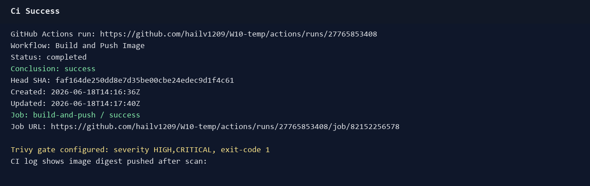
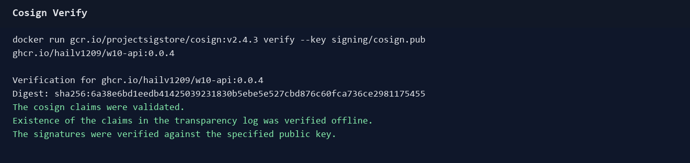
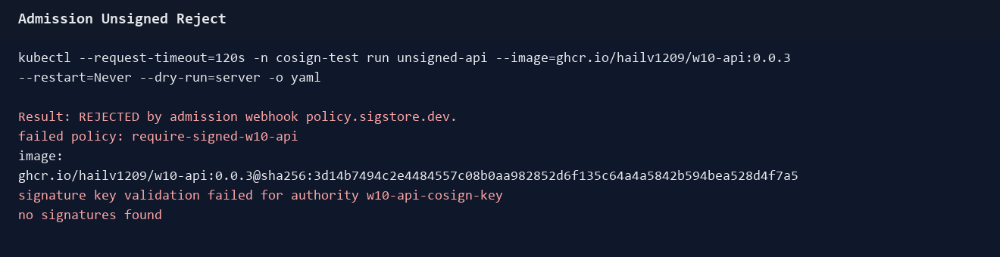
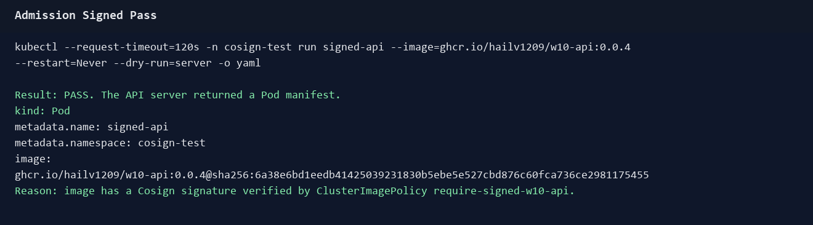

# Lab 2.2 - Trivy + Cosign

## Muc tieu

Cluster chi chay image da qua scan CVE va da ky. Lab nay map vao:

- F-05: Trivy trong CI fail pipeline neu image co CVE `HIGH` hoac `CRITICAL`.
- F-06: Cosign ky image sau khi build/push.
- F-06: Sigstore Policy Controller verify signature o admission, image chua ky bi reject.

## File da them/sua

- `.github/workflows/build-push.yml`: build image local, scan bang Trivy, chi push neu scan pass, sau do Cosign sign dung cac tag vua push.
- `signing/cosign.pub`: public key dung cho verify admission.
- `.gitignore`: ignore `signing/*.key`, vi private key khong duoc commit.
- `argocd/apps/policy-controller.yaml`: cai Sigstore Policy Controller bang Helm, wave `1`.
- `argocd/apps/policies.yaml`: sync folder `policies/`, wave `2`.
- `policies/cluster-image-policy.yaml`: `ClusterImagePolicy` yeu cau image `ghcr.io/hailv1209/w10-api*` phai co signature tu public key.
- `app-common/demo-namespace.yaml`: bat label `policy.sigstore.dev/include=true` sau khi image `0.0.4` da duoc ky.
- `docs/adr/ADR-0001-trivy-cve-exceptions.md`: template exception co thoi han neu vendor chua co ban fix.

## Key va GitHub Secrets

Keypair duoc tao bang Cosign container:

```powershell
$env:COSIGN_PASSWORD = "<passphrase>"
docker run --rm -e COSIGN_PASSWORD -v ${PWD}\signing:/work -w /work `
  gcr.io/projectsigstore/cosign:v2.4.3 generate-key-pair
```

Private key `signing/cosign.key` bi `.gitignore`, khong commit. Da upload vao GitHub Actions Secrets:

- `COSIGN_PRIVATE_KEY`
- `COSIGN_PASSWORD`

Public key `signing/cosign.pub` duoc commit va duoc dan vao `policies/cluster-image-policy.yaml`.

## CI flow

Workflow build hien tai:

1. Tinh semantic version.
2. Build image local voi cac tag `latest`, version, va sha tag.
3. Chay Trivy:

```yaml
severity: HIGH,CRITICAL
vuln-type: os,library
exit-code: '1'
```

4. Neu scan pass thi push image tags len GHCR.
5. Cai Cosign va sign tung tag:

```bash
cosign sign --yes --key env://COSIGN_PRIVATE_KEY "$tag"
```

6. Update `app-api/rollout.yaml` sang tag version moi.

## Admission verify

Policy Controller duoc cai truoc policy de tranh loi CRD chua ton tai. `ClusterImagePolicy` dung public key de verify image:

```yaml
apiVersion: policy.sigstore.dev/v1beta1
kind: ClusterImagePolicy
spec:
  images:
    - glob: ghcr.io/hailv1209/w10-api*
  authorities:
    - name: w10-api-cosign-key
      key:
        data: |
          -----BEGIN PUBLIC KEY-----
          ...
          -----END PUBLIC KEY-----
```

Namespace chi bi enforce khi co label:

```powershell
kubectl label namespace demo policy.sigstore.dev/include=true --overwrite
```

Label nay duoc bat sau khi image `ghcr.io/hailv1209/w10-api:0.0.4` da duoc CI ky. Neu bat label truoc khi image dang chay duoc ky, rollout/reschedule cua app co the bi admission reject.

## Luu y moi truong lab

Tren cluster WSL mot node, Policy Controller webhook tung bi OOM/timeout voi memory limit `512Mi` va probe timeout `1s`. Da tang limit GitOps len `1Gi/500m`. Trong luc nghiem thu truc tiep, probe timeout cua Deployment duoc patch len `10s` de tranh kubelet restart webhook khi node WSL bi cham.

## Nghiem thu

### 1. CI xanh sau Trivy + Cosign

Workflow run thanh cong: https://github.com/hailv1209/W10-temp/actions/runs/27765853408



### 2. Image da ky verify duoc bang public key

Image tu CI: `ghcr.io/hailv1209/w10-api:0.0.4`



### 3. Admission reject image chua ky

Namespace test `cosign-test` co label `policy.sigstore.dev/include=true`. Image `0.0.3` chua co signature hop le nen bi reject.



### 4. Admission pass image da ky

Image `0.0.4` da duoc CI sign va admission server-side dry-run tra ve Pod manifest.



## Lenh kiem tra nhanh

```powershell
kubectl get clusterimagepolicy require-signed-w10-api -o yaml
kubectl get ns demo --show-labels
kubectl -n cosign-test run unsigned-api --image=ghcr.io/hailv1209/w10-api:0.0.3 --restart=Never --dry-run=server -o yaml
kubectl -n cosign-test run signed-api --image=ghcr.io/hailv1209/w10-api:0.0.4 --restart=Never --dry-run=server -o yaml
```

## Ket luan

- Push image co CVE `HIGH/CRITICAL`: CI se do do Trivy `exit-code: 1`.
- Deploy image chua ky: admission reject voi `no signatures found`.
- Deploy image da ky tu CI: admission pass.
- Private signing key khong co trong repo; chi public key duoc commit.
